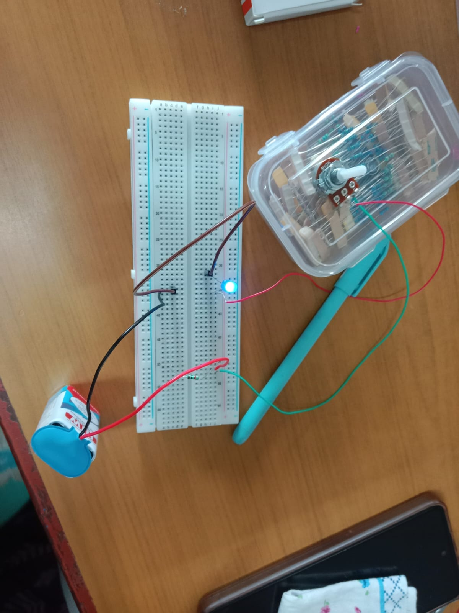

# LED Brightness Control using a Potentiometer

## AIM

To construct a circuit that controls the brightness of an LED using a potentiometer, and to study how varying resistance affects current and light intensity.

## COMPONENTS REQUIRED

1. Battery  
2. Potentiometer  
3. Resistor  
4. LED  
5. Breadboard  
6. Jumper wires

## PROCEDURE

1\.   Insert the 1 kΩ resistor into the breadboard as the current-limiting element.

2\.   Connect the potentiometer in series with the resistor.  
3\.   Insert the LED with correct polarity — anode (long leg) toward the resistor, cathode (short leg) toward the negative rail.  
4\.   Connect the 9V battery's positive terminal to the potentiometer and negative terminal to the LED's cathode side.  
5\.   Verify all connections against the circuit diagram.  
6\.   Connect the battery and observe the LED.  
7\.   Rotate the potentiometer knob and note the change in brightness.

## WORKING

The circuit operates on Ohm's Law (I \= V/R). The battery drives current through the potentiometer, resistor, and LED in series. The fixed 1 kΩ resistor always limits current to protect the LED. The potentiometer adds a variable 0–10 kΩ in series — as its resistance increases, total circuit resistance rises and current (hence brightness) falls; as it decreases, current rises and the LED brightens. This gives manual, continuous control of LED brightness without any digital circuitry.

## OBSERVATION

•     LED lights up immediately on connecting the battery, confirming correct polarity.  
•     Brightness increases as the potentiometer resistance is decreased   
•     Brightness decreases as resistance is increased (current ≈ 0.53 mA at 10 kΩ).  
•     LED brightness varies smoothly and reversibly across the pot's full range.  

